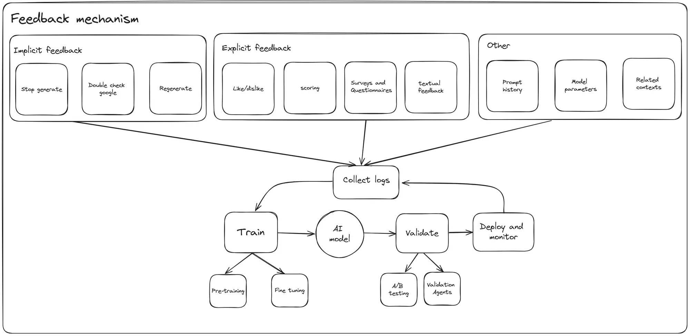
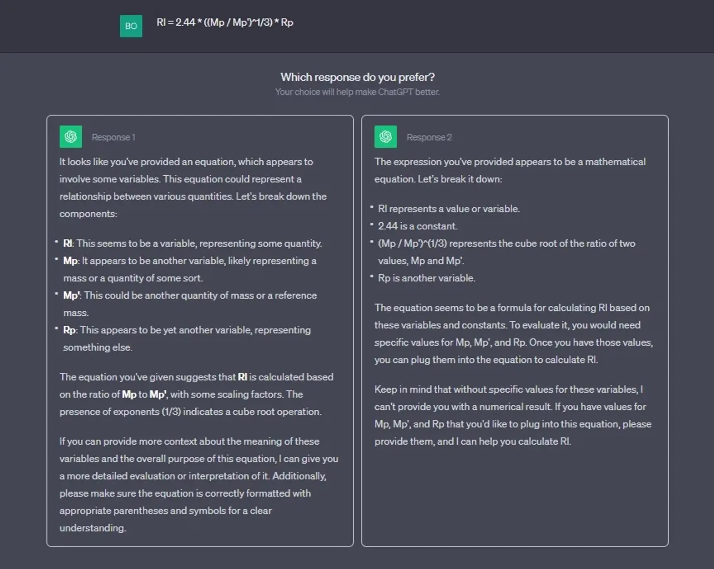

---
tags:
  - llm
  - feedback
  - mechanism
title: "History of Structured Outputs for LLMs"
date: 2024-06-11
description: "Understanding what large language models (LLMs) produce is important because they can give different answers to the same question. Collecting user feedback, both obvious and hidden, is key to improving these models. Implicit feedback includes actions like stopping the AI, checking Google, or regenerating responses. Explicit feedback involves direct input like likes, scores, surveys, and textual comments. This feedback helps improve AI through techniques like Reinforcement Learning from Human Feedback (RLHF). The process involves collecting logs, training, validating, deploying, and monitoring. Human-in-the-loop (HITL) feedback ensures quality, customization, ethical control, and clarity in LLMs."
authors:
  - datnguyennnx
---

Understanding what huge language models create is critical since they can generate diverse responses to the same query. As we all know, collecting feedback from users, both obvious and hidden, is very important for improving the performance and usability of these models. This article discusses how we collect and use user feedback to improve models.

## Implicit and Explicit Feedback: Collection and Utilization

### Implicit Feedback

Implicit feedback comes from how users behave when they interact with an AI model, without them directly telling us what they think. There are a few main ways we notice this:

1. **Stop Generate**: If users stop the AI from generating a response quickly, it usually means they don't like what it's saying or find it irrelevant. For example, if they read a few lines and feel it's not helpful, they might stop it.
2. **Double Check Google**: When users go to search engines to check information from the AI, it shows they might not trust what it said. This often happens if the AI gives answers that seem made up, especially with numbers or dates.
3. **Regenerate**: If users ask for a new answer, it means they didn't like the first one. They might use a button to get a different response when the first one doesn't meet their needs. For instance, they might want a better answer to the same question.

### Explicit Feedback

Explicit feedback involves users directly communicating their satisfaction or dissatisfaction with the AI’s responses. The methods include:

1. **Like/Dislike**: Users can give a thumbs up if they like the response or thumbs down if they don’t. This quick feedback helps us know how well the AI’s answers are working. For example, a thumbs up means they found it useful, while a thumbs down means it wasn’t helpful.
2. **Scoring**: Users can give a score to show how good they think the response is. This lets them give detailed feedback on whether the answer was great or just okay. For instance, a 5-star rating helps us see where the AI did well, and a 4-star rating shows areas for improvement.
3. **Surveys and Questionnaires**: These ask users specific questions about how well the AI is doing. They can give detailed feedback on what they like and what could be better. For example, a survey might ask about accuracy, how easy it was to use, and if the tone was right.
4. **Textual Feedback**: Users can write their thoughts on the AI’s responses. This lets them explain in detail what worked or didn’t work for them. For instance, they might say how a response helped with their work or where it missed the mark.

This feedback really helps improve the AI over time. We use techniques like Reinforcement Learning from Human Feedback ( RLHF ) to turn this feedback into rewards and ways to make the AI’s answers even better.

### Collecting and Utilizing Feedback for Model Training

The feedback collected is logged meticulously to build a comprehensive dataset that informs the training and fine-tuning processes. Here’s how it works:

1. **Collect Logs**: All interactions, implicit and explicit feedback, along with additional context like prompt history and model parameters, are logged.
2. **Train**: With this data, the model goes through two phases. First, it learns from big sets of data to build a strong base. Then, it adjusts based on specific feedback to make its responses better.
3. **Validate**: The updated model is then validated through A/B testing and with validation agents to ensure the changes lead to improved performance.
4. **Deploy and Monitor**: The refined model is deployed, and its performance is continuously monitored using the ongoing collection of user feedback.

Getting feedback from users is super important for making AI models like LLMs better. By using both what they say and what they do, we can make the model fit what they want. This doesn't just make it more right and keep users happy but also makes sure we're making AI that's safe and fair.

### Advantages of Human in the Loop in LLMs

- **Improved Quality and Trust:** Human reviewers can help improve the quality and accuracy of LLM outputs, making them more reliable and trustworthy. This is particularly important in applications where errors or biases can have significant consequences.
- **Adaptability and Customization:** HITL allows LLMs to be customized for specific tasks or industries. Human input ensures the model aligns with domain-specific requirements and can handle nuances and complexities.
- **Ethical Control:** HITL can prevent generating harmful, biased, or inappropriate content by providing human oversight and moderation. This is essential for maintaining ethical standards.
- **Addressing Uncertainty:** LLMs can sometimes produce uncertain or ambiguous responses. Human reviewers can resolve such uncertainty, making the model more useful when clarity is essential.

### Reference

- [Evaluating LLM Outputs (cohere.com)](https://cohere.com/blog/evaluating-llm-outputs)
- [Human in the Loop feedback (orq.ai)](https://docs.orq.ai/docs/human-in-the-loop-feedback)
- [Human in the Loop - Machine Learning - Definition & Examples | Encord](https://encord.com/blog/human-in-the-loop-ai/#:~:text=What%20is%20HITL%3F-,Human%2Din%2Dthe%2Dloop%20(HITL)%20is%20an,%2C%20accuracy%2C%20and%20training%20outcomes.)