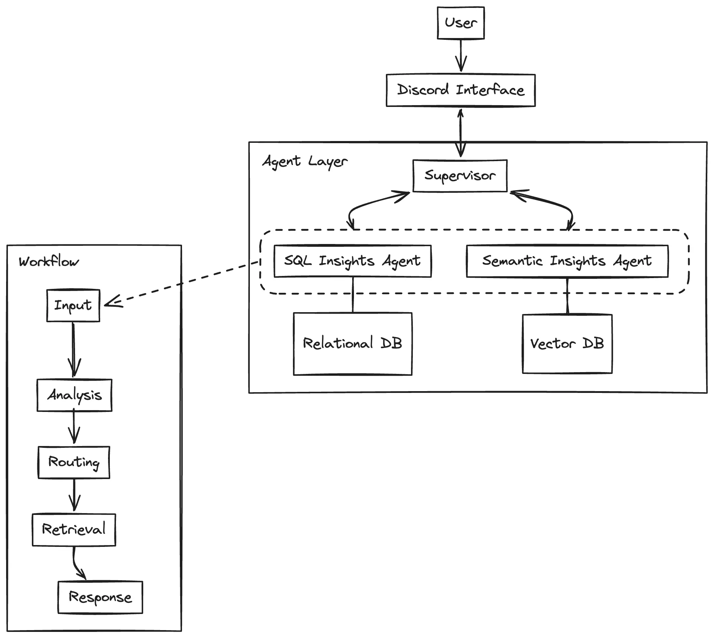

## Introduction

In the rapidly evolving field of artificial intelligence, the concept of agent supervisors has emerged as a powerful approach to orchestrating multiple AI agents for complex tasks. This article explores how building agent supervisors can lead to generating valuable insights, with a focus on a practical implementation in a Discord bot.

## Case Study: Discord Bot with Supervisor Architecture

Our team has developed a Discord bot that leverages the agent supervisor approach using Langgraph. This system demonstrates the power of coordinating multiple specialized agents to handle user queries efficiently and generate insights from various data sources.

### Key Components
1. **User Interface**: Discord chat, where users input their queries through slash commands.
2. **Supervisor**: Implemented with Langgraph, orchestrating the workflow and decision-making process.
3. **Agents**:
    - SQL Insights Agent: Translates natural language to SQL and queries the database.
    - Semantic Insights Agent: Deals with unstructured data, leveraging a vector database for semantic searches.
4. **Databases**:
    - Relational database: Stores discord server events data
    - Vector database for semantic search

### Workflow

The workflow begins when a user inputs a query through Discord. The Langgraph-based supervisor analyzes the query, interpreting the natural language input and determining the intent. Based on this analysis, it routes the query to the appropriate agent:

- **SQL Insights Agent**: Handles queries related to structured data stored in the relational database.
- **Semantic Insights Agent**: Processes queries requiring insights from past Discord messages stored in the vector database.

After data retrieval and processing by the respective agent, the results are synthesized and presented back to the user in Discord.

## SQL Insights Agent Deep Dive

The SQL Insights Agent is a crucial component of our system, designed to bridge the gap between natural language queries and database operations. Here's how it works:

1. **Text-to-SQL Conversion**:
    - Utilizes sqlcoder, an advanced NLP model trained to translate natural language queries into SQL statements.
    - Processes the user's input, identifying key entities and actions required to fulfill the query.

2. **SQL Verification**:
    - Employs llama-2 to ensure the correctness and efficiency of the SQL statement.
    - Reviews the SQL query for syntax errors, logical inconsistencies, and potential performance issues.
    - Suggests or directly applies corrections to the SQL query if needed.

3. **SQL Execution**: Runs the verified SQL query against the PostgreSQL database.

4. **Result Processing**:
    - Formats retrieved data for clarity and relevance.
    - Handles errors by generating informative messages or suggestions for query rephrasing.
    - Aims for a 95% success rate in query execution and result retrieval.

## Benefits of This Architecture

This architecture offers several key benefits:

1. **Flexibility**:
    - Dynamic query routing ensures optimal handling of each query.
    - Modular design allows for seamless expansion and simplified maintenance.

2. **Natural Language Interface**:
    - Makes the system accessible to non-technical users.
    - Allows intuitive expression of queries, reducing the learning curve.
    - Enhances user engagement through ease of use.

3. **Semantic Search Integration**:
    - Enables context-aware insights and improved relevance of results.
    - Allows effective utilization of unstructured data like chat messages.

4. **Robust Error Handling**:
    - Multiple layers of verification and correction ensure high accuracy and reliability.
    - Builds user trust and confidence in the system's capabilities.

## Challenges and Considerations

Despite its benefits, the system faces several challenges:

1. Query disambiguation to ensure correct interpretation of user intent.
2. Data privacy management when preprocessing Discord messages.
3. Performance optimization to balance SQL queries and semantic searches.
4. Designing for scalability to handle increasing users and growing databases.

## Areas for Improvement

To enhance the system's performance, we've identified two key areas for improvement:

1. **Larger models for better SQL accuracy**: Implementing more advanced LLMs could provide better context and semantic nuance to text-to-SQL queries.

2. **Better prompting strategies**: Developing improved prompting techniques, such as few-shot prompting or more chained prompting strategies, could substantially increase the accuracy of smaller models.

## Conclusion

Our Discord bot implementation demonstrates the practical application of agent supervisors in creating intelligent, multi-faceted systems. By combining SQL capabilities with semantic search and wrapping it in a user-friendly interface, we've created a powerful tool for generating insights from both structured and unstructured data sources.