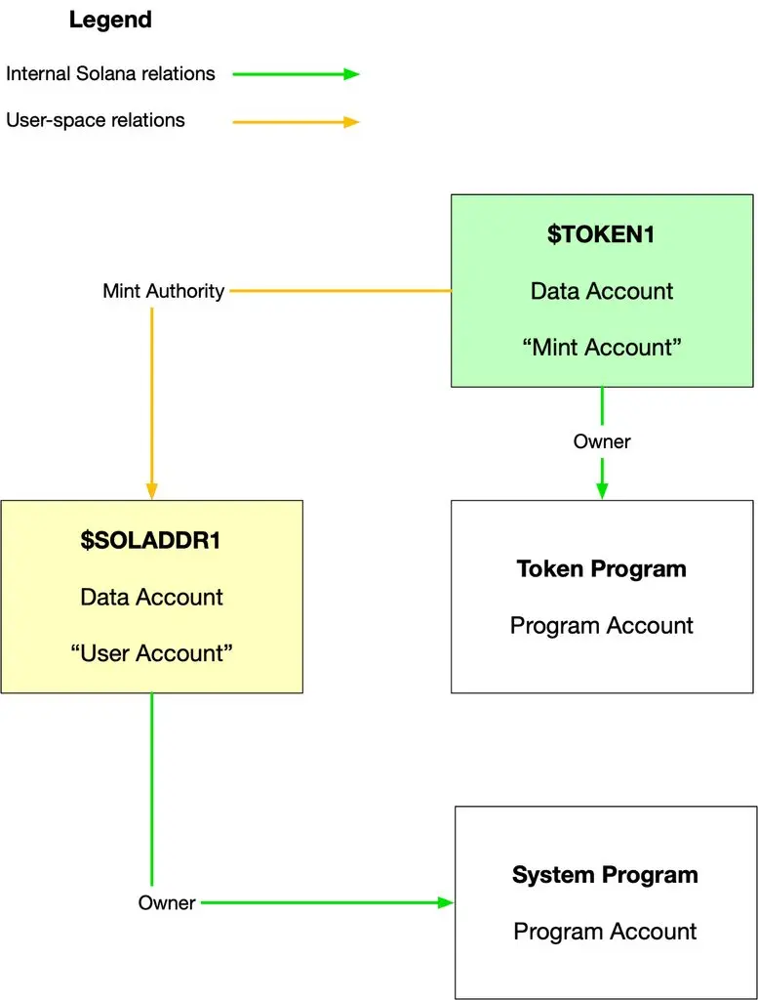
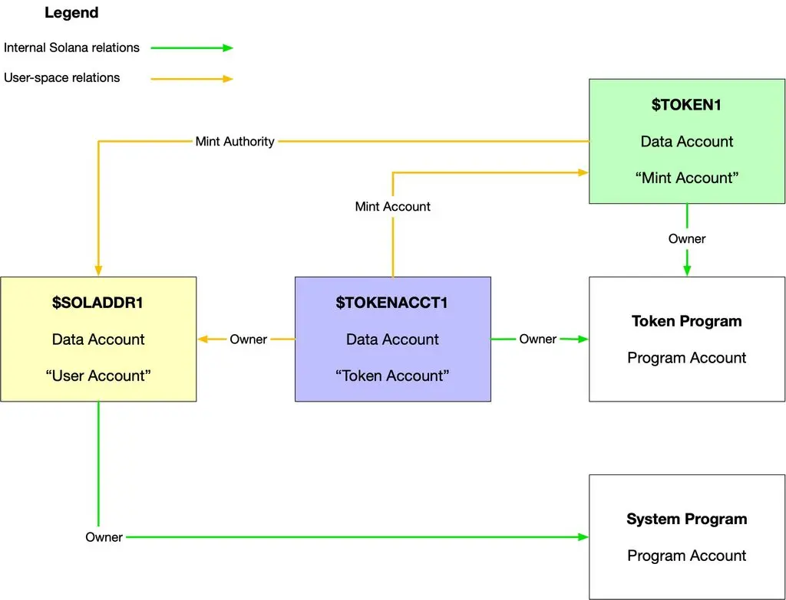
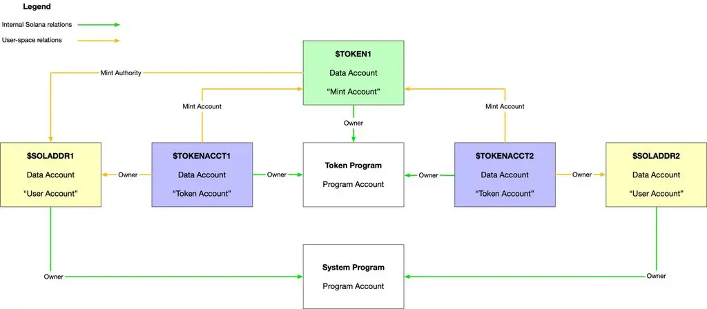

## How tokens work on solana - explain for EVM developers
> **Let's say you want to create a new type of fungible token, mint some to yourself, and then transfer some to your friend. What would you do?**

- As a EVM developer, you have to deploy a new ERC20 smart contract.
- On Solana, you don't need to create a new contract. There is a single token program (which was deployed by the Solana team) which responsible for creating, minting and transfering tokens.
- In order to create a new token, you send the `create` instruction to the token program. This creates a new `mint account`. Each type of token is associated with exactly one `mint account` which holds metadata about the token (likes `total supply`, `decimals`, `mint authority` - who allowed to mint, `freeze authority` - who allowed to freeze account ).

- You've just created a new token but you don't own any amount of this token yet. From `mint account`, you have to create a `token account`. A `token account` stores how many tokens a particular user has, for a particular type of token.

- Now, you have a `mint account` and a `token account`. Let's mint some tokens. To mint, you just send the `mint` instruction to the token program, which tells the program how many tokens to mint and whom to mint them to. Only one user is allowed to mint a token of a particular type (the `mint authority` which mentioned above)

- To transfer tokens, no surprises, you send the `transfer` instruction to the token program, which tells it how many tokens to transfer and whom to transfer them. Note that the recipient must also own a `token account` for the type of token you're transferring.

- What about NFTs? To create an NFT, you also use the same token program (what!!!), but these are some differences in how they are created and minted.
- As you know, an NFT is just a token that has one `total supply` and zero `decimal`. To create an NFT, you just need to create a `mint account` which has zero `decimal`. After that, you mint only one token of this NFT and disable future minting. This ensures there will only ever be one.
- In practice, most people use Candy Machine to create NFTs, which abstracts all this complexity away.
- But how can I config the name and symbol for my token? To do that, you need to create a pull request to [Solana Token Registry](https://github.com/solana-labs/token-list). Include a JSON file containing your token metadata (chain id, address, symbol, logo, name ...). Click [here](https://github.com/solana-labs/token-list) for more information.

## Reference
- https://spl.solana.com/token
- https://spl.solana.com/associated-token-account
- https://twitter.com/pencilflip/status/1454141877972779013

---
<!-- cta -->

### Contributing
At Dwarves, we encourage our people to read, write, share what we learn with others, and [[CONTRIBUTING|contributing to the Brainery]] is an important part of our learning culture. For visitors, you are welcome to read them, contribute to them, and suggest additions. We maintain a monthly pool of $1500 to reward contributors who support our journey of lifelong growth in knowledge and network.

### Love what we are doing?
- Check out our [products](https://superbits.co)
- Hire us to [build your software](https://d.foundation)
- Join us, [we are also hiring](https://github.com/dwarvesf/WeAreHiring)
- Visit our [Discord Learning Site](https://discord.gg/dzNBpNTVEZ)
- Visit our [GitHub](https://github.com/dwarvesf)