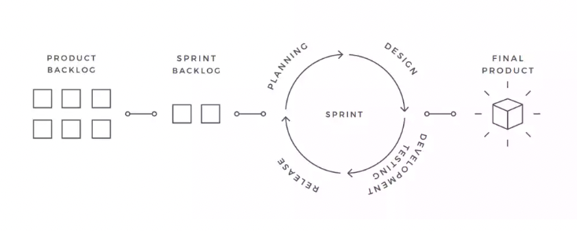
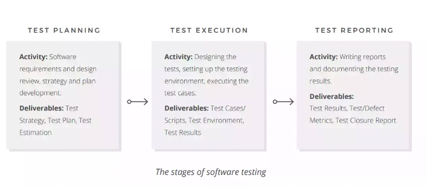

## Definition of Software Quality Assurance
`Software Quality` is the degree of conformance to explicit or implicit requirements and expectations. This leads to 2 levels of Software Quality:
- Functional: the product’s compliance with functional (explicit) requirements and design specifications. This aspect focuses on the practical use of software, from the point of view of the user: its features, performance, ease of use, absence of defects.
- Non-functional: system’s inner characteristics and architecture, i.e. structural (implicit) requirements. This includes the code maintainability, understandability, efficiency, and security.

`Software Quality Assurance` is a process that assures the software product meets and complies with the organization’s specification. It is a set of activities that verifies everyone involved in project implemented correct procedures and processes.

## Attributes of Software Quality Assurance
There are some properties that we can based on that to assure quality:
- Correctness: extent to which a project fulfills its specifications.
- Efficiency: use of resources execution and storage.
- Flexibility: ease of making changes required by changes in the operating environment.
- Integrity: protection of the project from unauthorized access.
- Interoperability: effort required to integrate the system to another system.
- Maintainability: effort required to locate and fix a fault in the project within its operating environment.
- Portability: effort required to transfer a project from one environment to another.
- Reliability: ability not to fail.
- Reusability: ease of re-using software in a different context.
- Testability: ease of testing the project to ensure that it is error-free and meets its specification.
- Usability: ease of use of the software.

## Why we need Software Quality Assurance
1. Common problem 
- Feature has many bugs. So who will be responsible for that ? There’s one story about it: QC engineer said: “Hey developer A, did you implement this feature ? It has many bugs”. Developer A said: “No it’s not bug, I just follow the design of Architecture Engineer”. Architecture Engineer said: “The design follows what Project Manager said”. PM said: “No, this is because customer keep changing their requirement”. The story just keep going and it takes us a lot time just to argue. So why this happen ? People usually blame each other and they just care about their job, like developer just care about coding and when requirement changes they will say it’s not their fault.

    So the point here is lack of knowledge → we need to know carefully about software procedure.
- The relationship between Developer and QA/QC is not good. This is because some developer will be uncomfortable when QC keeps complaining about the bug and requires developer to fix that. This lead to many quarrel.
    
    So the point here is lack of knowledge about QA/QC role. Their role is:
    
    - Use feature and let Developer knows if the result is success or fail.
    - They will assure that if Developer follows procedure or not.
- Junior or some inexperienced developer skip some step in software procedure like they don’t carefully ask for the requirement and they don’t design system carefully but start to implement the feature. This will lead to implement wrong and will take a lot of time to fix it.
    
    So the point here is lack of knowledge about software procedure
- Some developer does not test their feature carefully like not write unit test, not test their feature on staging env and release to production, or they have mindset “implement first, fix bug later”, … And when deliver to customer, they won’t accept that because there’s too many bugs. At this time developer needs to fix it and it will take more time than when they implement it.

2. Principles of Software Quality Assurance:

From many problems we met in real project, we should know principles of SQA to do our job better:

- Testing show mistakes: So when QA test feature and feedback to developer. It’s normal there’s no need to quarrel, we should focus on fixing it.
- Early testing: Need to test the feature ASAP from the very beginning like unit test in code, test the feature in local → develop → staging → uat → production. The later we test, the more we pay. The chart below show that.
- Update test: As soon as the errors are fixed, the test scenarios become useless. It is important to review and update test regularly.

- Invalid and unexpected test: Need test all case can happen not only happy case or some basic invalid request.
- Independent test environment: Should be no change during the process of testing
- Context dependent: Not every software is tested the same way. For example: fintech software needs correctness so we need test very carefully, but corporate website needs speed and usuability.

## Role of Agile in Software Quality Assurance
We already know the spirit of Agile Development Lifecycle: `Retro and adapt`.  We run sprint, have a short planning for about 2 weeks. When have any issue then we figure it out and discuss what the best option for it. The cycle keeps continue to the final product (this means the product meets client’s requirement, …). This help us figure errors faster and fixed it ASAP.

## Process of Software Quality Assurance
We have known the importance of SQA then we should have effective plan for our software:
- Define Quality Assurance Plans to identify what to do to ensure quality.
    - The Quality plan describes how the management of quality will be applied to the project and confirms any quality standards, procedures, techniques that will be used in the project.
    - Quality plan must be develop at the beginning of the project
    - Can be a separate plan or a part of the project plan, depending on the types of the project
    - Quality must be part of the software development process, not something to be measured at the end.
    - Everybody on the project should be responsible for the quality, including project manager, developers, testers, quality assurance
- Support Project Manager to define standards, guidelines and other techniques for the projects
- Ensure systematic quality control of processes and products such as reviews, inspections, audits as well as configuration management/control, production release, project control, supplier contracting and management, document control, operations and support, maintenance, backup and recovery, and security.
    - Requirements Review: Testers review the software requirements to understand them and make sure that they are testable
    - Test Planning: Testers know what needs to be tested, and plan their testing activities such as: Prepare test strategy, test plan, test schedule and estimate the testing time
    - Test Designing: Testers begin to build test cases, test scripts and test data based on the requirements/design of the software
    - Test Environment Setup: Testers setup the test environment and make sure that it is the same as the users’ environment.
    - Test Execution: Testers execute their test cases and test scripts in the test environment to determine the quality of the software (Pass/Fail)
    - Test Reporting: Document the testing logs and status reports. Retrospective meeting will need to define and have solution to solve it.

- Maintain quality records to track issues.
- Analyze and report on quality issues to management.
- Maintain and improve quality of products

## Reference
- [Blogs of Prof. John Vu, Carnegie Mellon University](https://science-technology.vn/?s=chất+lượng+phần+mềm)
- [Altexsoft whitepapers](https://www.altexsoft.com/whitepapers/quality-assurance-quality-control-and-testing-the-basics-of-software-quality-management/)
- [Blogs of Danlew](https://blog.danlew.net/2022/06/22/maintaining-software-correctness/)