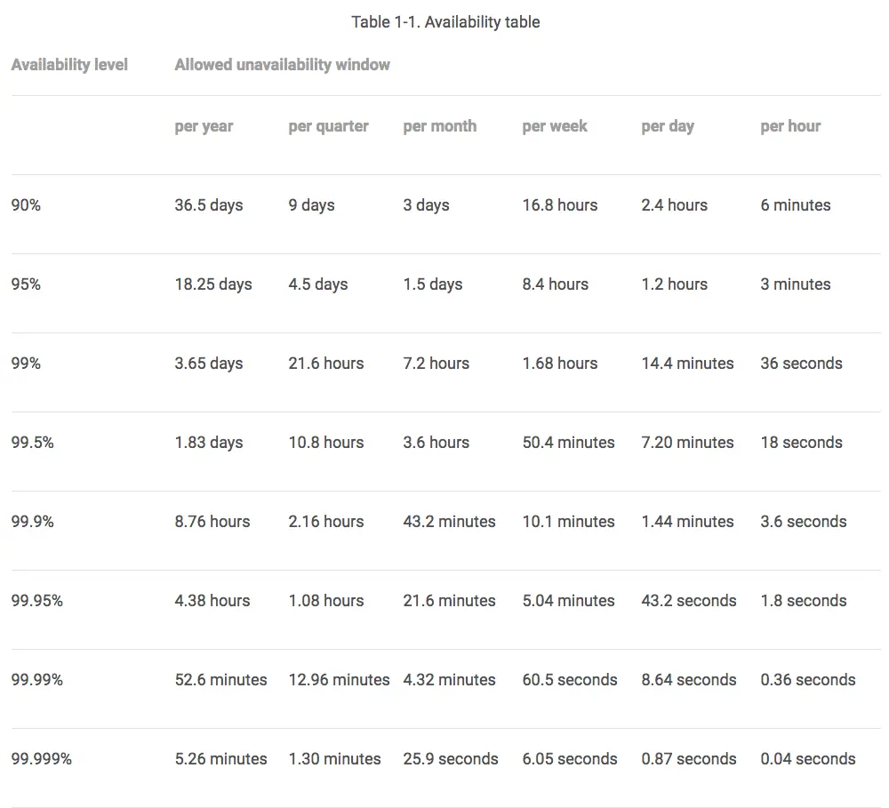
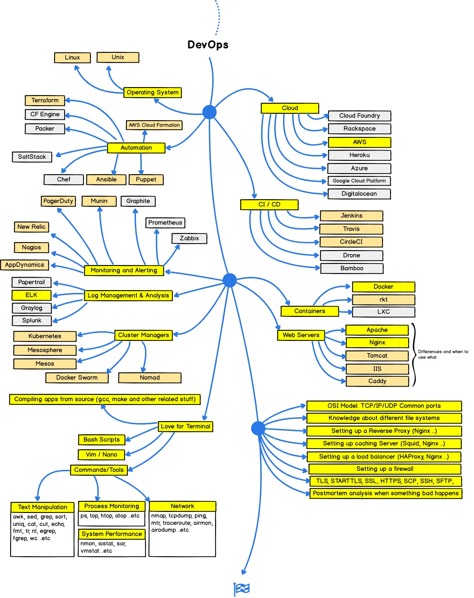

## What is DevOps actually?
DevOps is a culture with only one goal which is "improving the software lifecycle" (bug fixes, features, configurations) to end-users more frequently but still keep software's reliable.

It is a continuous process and contains various stages such as :

* Continuous Integration
* Continuous Development
* Continuous Testing
* Continuous Deployment
* Continuous Monitoring

The main role of DevOps is to increase the quality of product to a great extent and to increase the collaboration of Development and Operation team as well so that the workflow within the organization becomes smoother.

## Top core DevOps attributes
* Ability to code and script (Go, Python, Shell script)
* Process re-engineering
* Communicating and collaborating with other
* Comfortable working with distributed teams
* Ability to use a wide variety of open source technologies and tools
* Networking / system admin skills
* Comfort with frequent, incremental code testing and deployment
* Strong grasp of automation tools
* Data management skills
* A strong focus on business outcomes

Process re-engineering is probably the most telling skill. Engineers are not being hired to write code from scratch as much, but to find the best open source tools that can function with a company’s current platform and operating systems.

## SRE Table
Availability is generally calculated based on how long a service was unavailable over some period. Assuming no planned downtime, Table 1-1 indicates how much downtime is permitted to reach a given availability level.

Using an aggregate unavailability metric (i.e., "**X%** of all operations failed") is more useful than focusing on outage lengths for services that may be partially available—for instance, due to having multiple replicas, only some of which are unavailable—and for services whose load varies over the course of a day or week rather than remaining constant.

See Equations [Time-based availability](https://landing.google.com/sre/book/chapters/embracing-risk.html#risk-management_measuring-service-risk_time-availability-equation) and [Aggregate availability](https://landing.google.com/sre/book/chapters/embracing-risk.html#risk-management_measuring-service-risk_aggregate-availability-equation) in [Embracing Risk](https://landing.google.com/sre/book/chapters/embracing-risk.html) for calculations.

Reference: [https://landing.google.com/sre/book/chapters/availability-table.html](https://landing.google.com/sre/book/chapters/availability-table.html)

## Role definitions
**Software Tester**
 * Goal of Automation Testing is to reduce number of test cases to be run manually and not eliminate Manual Testing all together.
* Types of software testing:
  * Unit Testing
  * Functional Testing
  * Regression Testing
  * Black Box Testing
  * Integration Testing
  * Keyword Testing
  * Data Driven Testing
  * Smoke Testing
* The following category of test cases are not suitable for automation:
  * Test Cases that are newly designed and not executed manually atleast once
  * Test Cases for which the requirements are changing frequently
  * Test cases which are executed on ad-hoc basis.
* Automation Testing Tools:
  * Selenium
  * QTP (MicroFocus UFT)
  * Rational Functional Tester
  * WATIR
  * SilkTest

**Security Engineer**

Below is a list of the top five DevOps practices and tooling that can help improve overall security when incorporated directly into your end-to-end continuous integration/continuous delivery (CI/CD) pipeline:
* Code Analysis with Continuous Code Quality (consistency, readability, performance, test coverage, vulnerabilities…)
* Security test automation 
* Configuration and patch management 
* Continuous monitoring 

Reference tools:
* Code Quality
* Codebeat
* Codacy
* SonarQube
* SonarLint for VS Code (Current support: JavaScript, PHP, Python, TypeScript)
* Codeclimate
* **Codebeat**
* **gometalinter**

Monitoring:
* Sentry
* Datadog
* Deploying security solutions meeting one or more of the following security standards: NIST/FedRAMP, ISO 27001, ISO 27002, PCI DSS, **[HIPAA Security Rules](http://www.onlinetech.com/resources/references/what-is-the-hipaa-security-rule)**

**Application Developers**

* Goal: a new software release must be deployed quickly. We need to uses processes as well as tools to streamline the software delivery process and reduce the overall cycle time. To help automate and integrate all of the essential delivery steps in a holistic way, the DevOps approach also needs lightweight tool changes.

* How do we do?
  * Think "automation"
  * Write tests for continuous integration (CI).
  * Sharing ideas, issues, processes, tools, and goals.

* Code and scripts for DevOps include the following:
  * Code and scripts for building the application.
  * Code and scripts for unit testing the application.
  * Code and scripts for acceptance testing the application.
  * Code and scripts for deploying the application.
  * Code and script configuration options for configuring the application for different target environments.
  * Code and scripts for programming the attributes and “behavior” of the target environment.

* **System Admin**
 * Goal:
   * Ability to apply their skills to entire IT infrastructures described and managed by code. 
   * Ability to manage cloud services and use automated deployment tools and code repositories - and to share their expertise with others.

* How to have Devops skills
  * Needed: New technical skills
  * Coding skill
  * Cloud services: AWS, Azure, GCP, etc.
  * Configuration Management and Infrastructure as code

* Reference tools:
  * Continuous integration servers: CircleCI, Gitlab runner, Jenkins, etc.
  * Ansible, Puppet, Chef
* Orchestration tools: K8s, DC/OS, etc.

## What will you do
* Ability to automate. You should have an instinct and intuition to automate whatever you can and improve the efficiency of our development environments, processes.
* Coding skills. You don’t need to be a C++ wizard, or mastering in Go, but you should at least have a good background in one or more high level scripting language.
* Configuration management. You should have real world experience with something like Puppet, Chef, Saltstack, or Ansible.
* System / infrastructure / 3rd-party providers management.
* Documentation

## Roadmap 2018

