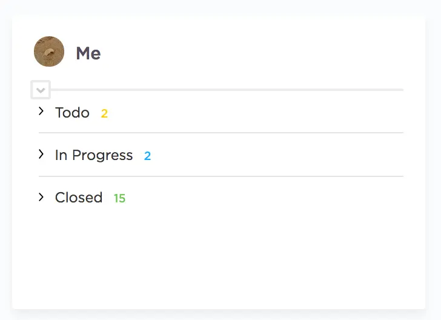
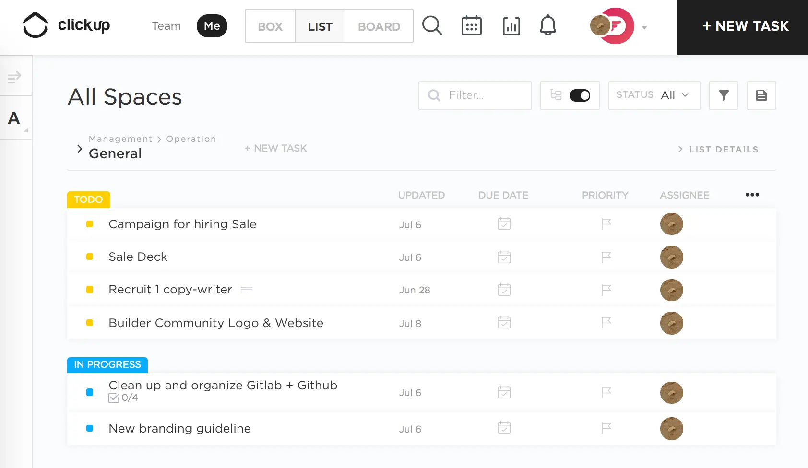

ClickUp is the powerful tool that we decided to stop by after Trello and the whole bundle of similar tool for Agile Management. With the fact that we pay ClickUp $9 per month because of their feature-rich platform, we still don't know how to use it to optimize our workflow.

## Introduction
ClickUp divides the structure as follow
* Space
* Project
* List
* Ticket

and support following Views
* Board as Kanban Board with columns showing the statuses. This is status-based view. This view is useful when you want to track the whole progress of the project.
* Box: showing the ticket for the individual in their box. This view is useful when you want to focus on your tickets and get things done.

* Calendar: showing the calendar with tickets due date. I found it's not very useful.
* List: Same as Board but in another point of view. Some people may find this view is clearer than Kanban board because it's more like a project todo list.

## Workflow
We do Agile Scrumban. So there are several required steps when using Agile Management Tool
* Ticket or task or Backlog Item should be put in a short loop called Sprint.
* Ticket should have description on how to complete it. 
* Ticket should have a definition of done.
* Person in charge is assigned.
* Deadline or due date is set.

**New project**
Create a new Space as Project
Create a first list as Backlog

**Sprint planning meeting**
Create a list as Sprint #

Do planning and create tickets in detailed with **Open** status or move them from backlog.

Use label to differentiate the ticket type e.g backend, frontend, design, ui, ux, etc.

**Sprint release**
Make sure every tickets is on the right side of the kanban board.

**Sprint retrospective meeting**
Archive the sprint.

## Suggestion on daily basis
To get my things done, I use **List View** with **Me** filter to show my assigned tickets across all the Spaces.

To keep track the whole project progress or member progress, both Board View, List View and Box View work very efficient.