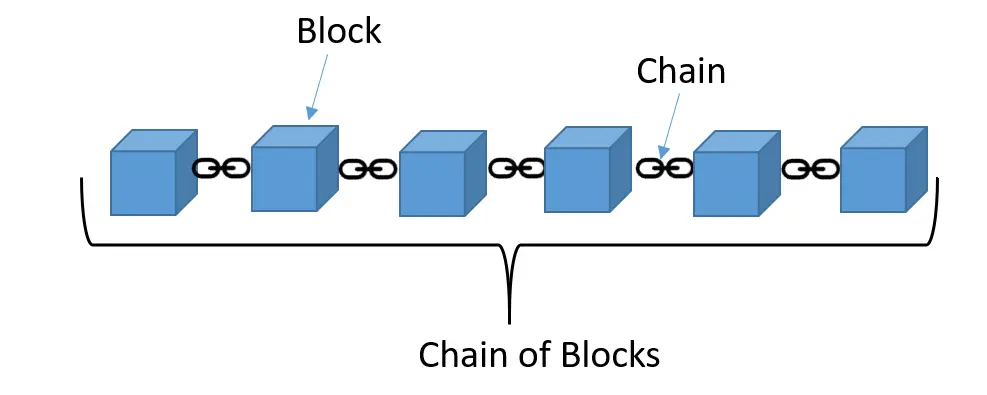
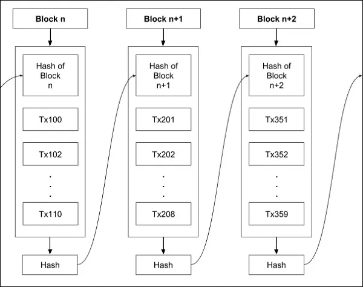
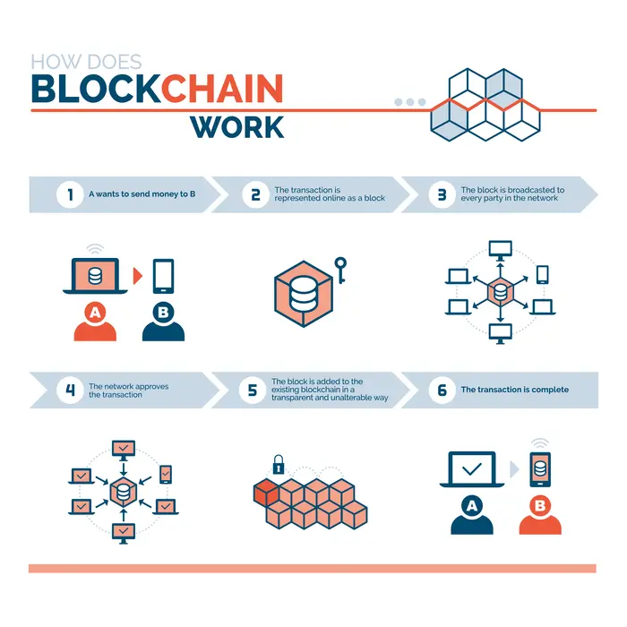
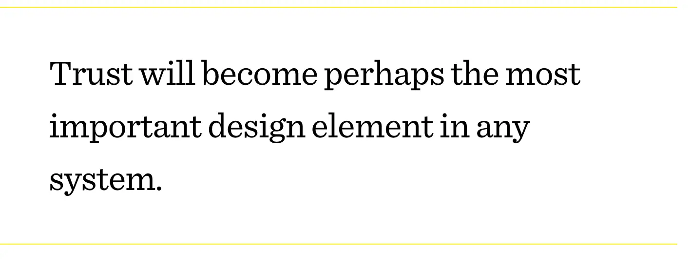
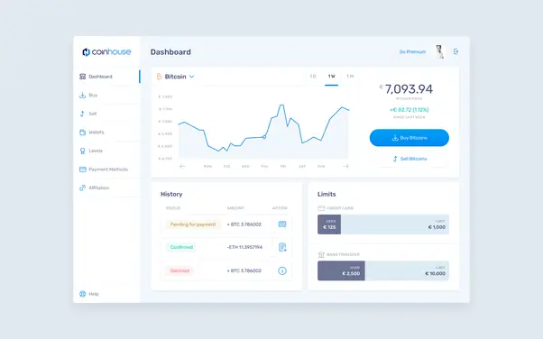
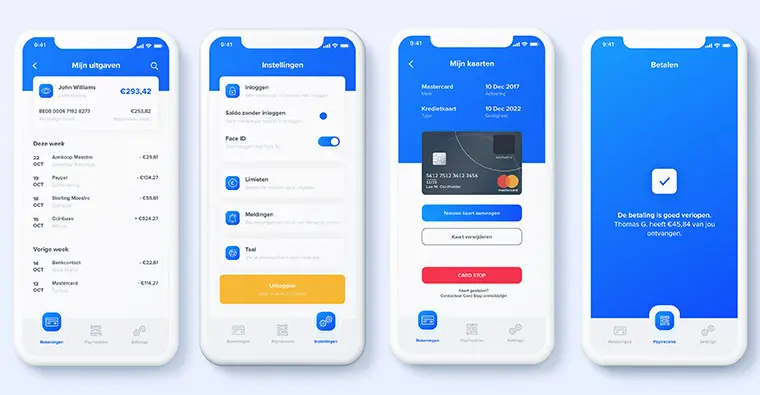

## Intro
Recently, **Bitcoin** and **Blockchain** become popular, they are the trending and media’s favorite topics. Blockchain is buzzing with the capability of solving trust issues in not only the technology but also other domains like economies and even government regulators. Though people are talking about this promising technology, it’s too complicated for everyone to understand what precisely it is and how it works. The complexity of Blockchain and what it does make users feel confused and suspicious, which builds a huge barrier between users and products. As product designers, our mission is to help users to comprehend Blockchain in a reliable way.

In this article, we are not going to talk deeply about the definition and the way it works. We explain Blockchain in a simpler way, by sharing the challenges we have met in the process of designing a product basing on Blockchain technology.

## Understand Blockchain

### Why Blockchain?
First of all, let’s start with the problem people are facing and solutions that Blockchain provides.

**Trust issue**
Trust is one of the biggest concerns of humans, especially, when it comes to money and personal assets. Due to the growth and power of bank in the past, people started to doubt an entity that took control of all a financial system. To solve this, blockchain technology builds credibility through transparency and security, in which information is encrypted and published. In other words, all transactions can be validated without relying on trust or relying on 3rd parties.

**Centralized database**
A centralized database is controlled by someone or an organization, who can access and alter data anytime. By storing data across its peer-to-peer network, Blockchain eliminates several risks that come with data being held centrally.

**Unclear information**
Blockchain operates in a decentralized form, which makes all information and transactions transparent. All transactions occurring must come from the consensus of many users.

The capabilities that Blockchain offers to solve these problems are explained in how a blockchain is structured.

### What is Blockchain

As the name, it is a chain of blocks that store data. Each block of a chain is connected with the previous one by a key called "hash". In a nutshell, a block contains data, its own hash, and the previous block’s hash. This structure links all the blocks one by one, making the chain continuous and unbreakable

### How it works

1. I want to send you money, so I create a transaction and submit it.
2. The transaction information is recorded and published to the blockchain network.
3. On the network, the record is combined with other transactions into a block - like a traditional database. When the block is created, it generates a time-stamp. Therefore, the transaction information is sequential and cannot be duplicated.
4. The completed block is broadcasted to all participants in the network.
5. Since all participants receive a copy of my transaction, they can view my transaction history and ensure the hashes are matched up. In the end, they can trust my records.
6. Participants validate and at least 51% of them approve the block. Then, it is added to the existing blockchain, permanently and inalterably.
7. The transaction is complete and you receive money.

A blockchain is essentially a digital ledger of transactions which is owned by nobody. All the information of transactions will be recorded, duplicated, and distributed across the blockchain network.

### Value proposition
The goal of Blockchain is to allow digital information to be recorded and distributed, but not edited. Understanding the meaning of the way Blockchain solving the trust issues among humans, we can come to the conclusion that the following outstanding values of Blockchain can completely solve the problems of trust that people are facing.

**Decentralization**
The Blockchain operates in a decentralized form, which makes all information and transactions transparent, as all transactions occurred must come from the consensus of many users. Every participant within the Blockchain network keeps the same copy of electronic data. Blockchain data is regularly updated with all the latest transactions and synchronized with all copies. When a user makes a transaction or inputs data, every system scattered in the peer-to-peer network verifies it. Moreover, there is no person or entity controlling the system. Hence, every party has equal rights to data and action.

**Transparency**
When a user creates a transaction in a Blockchain network, everyone in that network can see and approve the same. However, complex cryptography hides personal information like the name of the user. As a result, there is no corruption and misconduct in this system.

**Immutability**
No one can tamper data in a Blockchain network and thus it’s an immutable platform since hashing converts any input data into an unmatched string of text. Immutability keeps data be privacy, unattackable and imperishable.

## Help user to believe in the value of Blockchain
Blockchain is very complicated. Speaking of Blockchain, most people, especially not so tech-savvy ones, thought it was the movement of numbers, codes, magic, or whatever stored in some cloud in the sky. Some people even mistakenly believe that Blockchain is bitcoin and call it virtual money.

Product designers need to speak users' language, it's our mission to bring the most straightforward explanation of this technology to users. That's the one way we can help shape their perspective of blockchain and create products they trust enough to use.

User experience design is to convert complex concepts in the digital environment into a simple journey. Despite having to understand in-depth how blockchain works, we also have to think like a user. Users actually don't care about fancy blockchain or any technology. Their concern remains one thing: how does using this product help me with my life?

Like everything else, it starts with trust; the trust that this product helps me achieve things, solve problems; the trust that I'm safe using this product, my information is secured. **Design for trust**. Especially in this era of blockchain, we need a new type of product designer: "**Trust Architects**".

Besides, we designers also have to develop ways for prototyping, not only individual experience but also whole systems. Since Blockchain is a decentralized application, this is not for one persona only, but for a group of people collaborating and transfer value for one another.

### Blockchain design principles
As we researched and worked on multiple projects, we have analyzed through countless blockchain applications to come up with a list of current issues users encounter. Some cause users to approach these applications with a lot of distance.

* Blockchain jargons and technical language make it difficult to understand, lack of communication and costly regarding time complexity
* Unreadable data
* Transaction speed & Transparency

It’s tough to convince people to believe in terms that they have never heard before. What is the private key? What is a hash? Why does it take too long for a transaction compared to other traditional trading exchange? Who controls this network? Where is my money? Confusions and doubts are inevitable when users are required to approach new technology. To build trust and clearly communicate the values of Blockchain to users, there are fundamental principles that we must follow.

**Steady, painless exposure to new technology**
In order to create trust in the new technology, users need to understand and see how the application processes work. We also want users to understand how blockchain brings improvements to the way they normally do things. Those improvements could be data visibility. Be mindful of each piece of data we present on the app. In other words, shown-data must be straight-forward, desired call-to-actions are clear.

How to ease users into the blockchain domain?

* Show timelines to demonstrate the change of entities throughout the process
* Summarize information, make use of concise view even, to avoid clutter when representing information
* Visualize as much asset and application flow as you can using a dashboard

It’s important to avoid jargon, not everyone can understand these technical terms. We should present information clearly. Proper communication leads to solid trust.

**Consistency forms familiarity and trust-worthiness**
Establishing visual consistency across products and the customer experience is essential to the perception of trustworthiness. This includes the general layout of the applications (colors, icons, and typography) and the way we communicate with users (tone of voice). A consistent design gives a sense of familiarity which puts users at ease, help them pick up the new knowledge easier - an essential factor for new technologies like blockchain.

* Grid-based layouts (with meaningful and proportional negative space)
* Strong typographic hierarchy
* Colors with universal meanings
* A simple but concise language which aligns with users' natural communication patterns
* Consistent experience through and through, regardless of platform and device

Colors have a significant impact on the psychology of users. When it comes to trustworthiness, we should consider using colors that bring stability. Avoid choosing the vibrant color to show the decrease or increase of transactions, it might create unnecessary stress to users. Since Blockchain is a peer-to-peer network, clean and simple minimalistic UI or whatever trending styles are not always the super idea that will satisfy all users. There're always many types of users in a Blockchain network, hence, user research is the most important step in Blockchain design, to ensure the final product does not miss any object.

**Always communicate with the user**
The system is cross-border operated, in which users are the center of the process, so the language should be clear, concise, in common with user’s daily communication patterns. Besides, reducing cognitive load, guiding with consistency, and displaying messages properly are also good ways to keep in touch with users.

With Blockchain application, all users want to complete the process without any pain and secure their assets. Communicating is the best way to encourage users and remove their ambiguity. Motion and animation are also good choices, which bring peace of mind to users.

One important thing, don’t make users wait too long, though Blockchain is much lower than other traditional transactions, we need to keep updating the status to users, even if it is just a microcopy on the loading/processing screen. Otherwise, we can set proper expectations about the timing of tasks and activities within the product.

**Alert user about one-way actions**
Blockchain is known as a one-way action that keeps the network safe and transparent. There are no take-backs or undo's in a blockchain system. Forgot private key, wrong recipient information, cancel a transaction, etc., these problems cannot be resolved in a blockchain network. Therefore, we should design purposeful notifications, alerts, and confirmation at each important step for users, without falsely giving off a sense of danger. Be responsible for the user’s mental experience and physical assets is one of our duties

**Guide users until they accomplish their tasks** 
As we mentioned at the beginning of this article, there is a large awareness gap in the public about Blockchain. We are here to help bridge this gap. We can help simplify the complexity of the Blockchain until it becomes invisible. Begin with the easiest-to-understand onboarding journey, provide knowledge/tips at every step where they might experience confusion or doubts, make help available, and easy to access, encourage and guide users through their journeys to meet their goals. Plus, don’t hide any information. Blockchain brings transparency, a key benefit for users which not any 3rd parties can compete with.

**Constantly receive feedback and improve product** 
Even if we build something and release it, it’s only the beginning of the road. So it’s essential to be with the users through the whole app-building building process — and its future development. End users should be allowed to leave feedback, and want to leave feedback as if the product was something of their own. They should feel that we're listening to them, and we're gonna change the product for the better.

## Conclusion
The key value proposition of Blockchain is to provide users with transparency and efficiency. Many businesses take off by applying Blockchain, especially in finance, supply chain, healthcare, and gaming. Blockchain is believed to help users resolve trust issues when it comes to personal information and assets.

Thus, design for Blockchain is the most critical challenge for raising adoption. Effective UX design is essential to create useful and valuable applications. This keeps end-users comfortable and, eventually, forget about the sophisticated underlying technology.

Although Blockchain will change and develop in the future, the principle remains the same. That means product designers must always stay posted on new tech that can become a savior for users' pain points.
