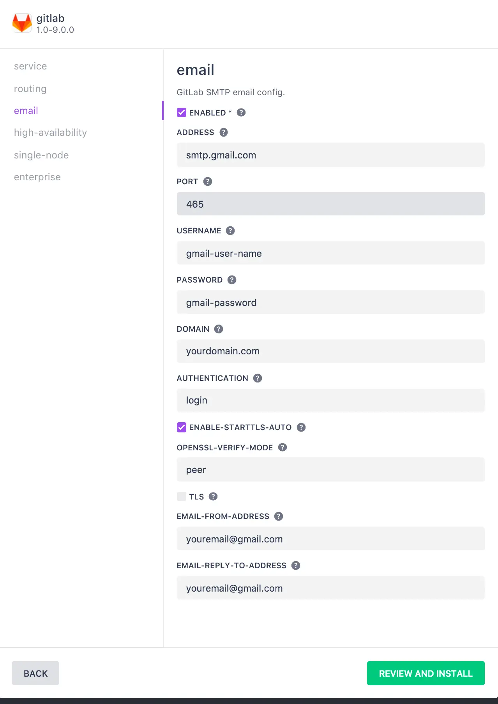
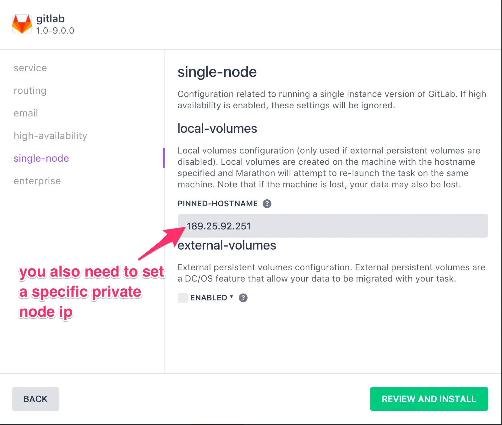

Gitlab an open source developer tool (like Github) that allows you to host git repositories, review code, track issues, host Docker images and perform continuous integration, and it is very compatible for a small team wit CE version.

DC/OS supports us to run our own private Gitlab to manage source code in house. This article will let you know how to setup Gitlab with HTTPS.

## Installing
You just need to go `Universe` > `Packages` and choose `Gitlab` to install it with `Advanced Installation`. We also may change these settings to have a smoothly Gitlab.

1. Setting up your gitlab domain


1. Setting up email client



1. Set a specific private node IP, so when we need to restart or upgrade new gitlab version, we wont lost data



After all, we can do `Review and Install`. If everything is OK, Gitlab service will be like this:


## Setting HTTPS
By default, Gitlab on DC/OS doesn’t supprt `HTTPS`, but we can customize a bit to make it more secure. To do that, we need to do a few things below to enable `HTTPS`, ok let’s do it now:

1. `Edit` service Gitlab and add below setting to env `GITLAB_OMNIBUS_CONFIG` then `Review & Run` it:

```plain_text
nginx['proxy_set_headers'] = {   \"X-Forwarded-Proto\" => \"https\",   \"X-Forwarded-Ssl\" => \"on\"  }
```

1. Copy your `.pem` files to public node which is running `marathon-lb`. For me, I will copy and paste it to`/srv/marathon-lb/domains/example-git-domain.com`

```plain_text
$ scp cert.pem core@public-ip:~
$ ssh core@public-ip
$ sudo mkdir -p /srv/marathon-lb/domains/ssl/example-git-domain.com
$ sudo mv cert.pem /srv/marathon-lb/domains/ssl/example-git-domain.com
```

1. Config `marathon-lb` service:

3.1. Add new sharing volumes

```plain_text
  {
    "containerPath": "/etc/ssl/domains",
    "hostPath": "/srv/marathon-lb/ssl/domains",
    "mode": "RO"
  }
```

3.2. Add `"/etc/ssl/domains/example-git-domain.com/cert.pem"\`to `args`in `JSON Editor`


3.3. `Review & Run` marathon-lb again to update new changes

After updating those settings, you now can go to `your-gitlab-domain.com` to enjoy your result.

If you face anything weird while setting up your Gitlab, you can contact me via `quang@dwarvesf.com.`
