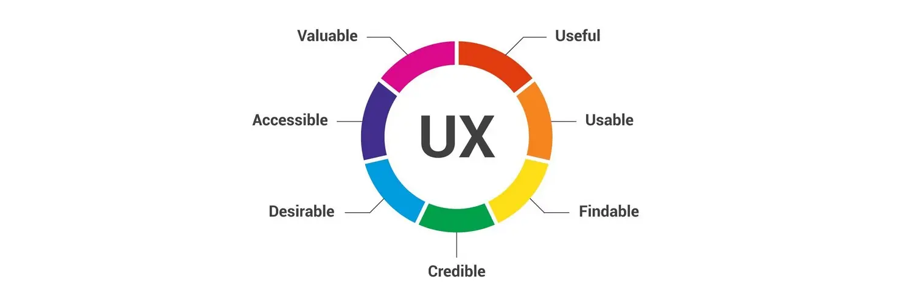
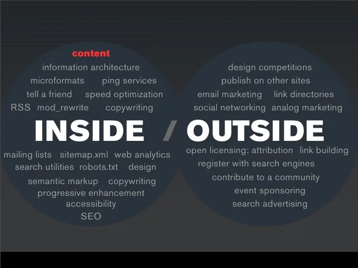
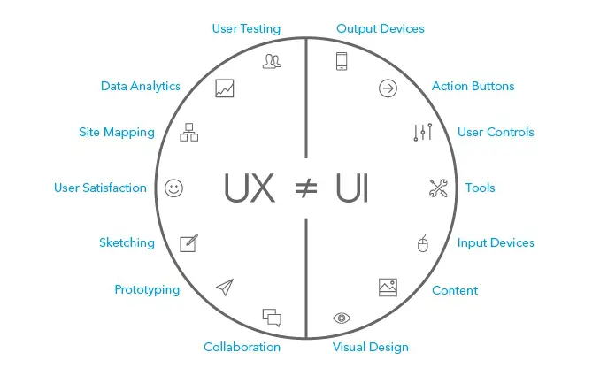

Good design is not just what looks good. It also needs to perform, convert, astonish, and fulfill its purpose. It can be innovative or it might just get the job done.

A good design cannot be measured by a finite way – multiple perspectives are needed.

## What is a good UX design?
User experience (UX) focuses on having a deep understanding of users, what they need, what they value, their abilities, and also their limitations. It also takes into account the business goals and objectives of the group managing the project. UX best practices promote improving the quality of the user’s interaction with and perceptions of your product and any related services.

*Before taking a closer look on what is a good UX design, there are some examples for you to feel what is a good and bad UX design:*

* *[https://uxdesign.cc/good-design-vs-bad-design-examples-from-everyday-experiences-18a7d1ba002c](https://uxdesign.cc/good-design-vs-bad-design-examples-from-everyday-experiences-18a7d1ba002c)*
* *[https://www.interaction-design.org/literature/article/bad-design-vs-good-design-5-examples-we-can-learn-frombad-design-vs-good-design-5-examples-we-can-learn-from-130706](https://www.interaction-design.org/literature/article/bad-design-vs-good-design-5-examples-we-can-learn-frombad-design-vs-good-design-5-examples-we-can-learn-from-130706)*

## The 7 Factors that Influence User Experience

Good design is not just what looks good. It also needs to perform, convert, astonish, and fulfill its purpose. It can be innovative or it might just get the job done.

A good design cannot be measured by a finite way – multiple perspectives are needed.

### 1. Useful
A new product should first be designed to fulfil the users' needs.

If the design doesn’t help users to successfully achieve what they need, it’s definitely not a good design. It doesn’t matter how good it looks if it doesn’t even accomplish the main purpose of its existence.

### 2. Usability
A product should be designed that it is easy to use. If it takes so much time for the users to get what they want out of the product, they would be likely to find another product with less struggles to deal with.

Improving the ease of use of the product is the work of interaction designers. It is including the ease of learning and efficiency.

* Easy to learn refers to the user in contact with a new product, it is best to learn it easily and naturally.
* The content of efficiency includes easy manipulation (Fitts's Rule), simple steps (the number of clicks to complete the task), clear navigation (always know where they are, not lost).

Designers in all three disciplines seek to create product features that are easily discovered and operated by the user. Usability engineers are concerned with aspects of the user experience, that include:

* Learnability: Can users easily learn how to operate the product, and can they remember how to perform tasks when they return to the product the next time?
* Consistency: Are product features clearly and consistently labeled?
* Efficiency and effectiveness: Can users perform tasks with a minimal amount of effort and achieve their goals successfully?

### 3. Accessibility
Accessibility is the ability to access (i.e., use and/or interact with) a product or service. In the design context, accessibility means that a product or service should be able to be used by everyone, regardless of a person’s physical, economic or cultural status. Studies have shown that accessible design benefits not only users with disabilities but everyone.

There are four main types of impairment that will commonly affect digital projects: sight, hearing, touch and cognitive. Don’t rely on one sense alone to make your product or feature usable, but instead allow multiple forms of interaction and communication where possible — for example enabling text-to-speech functions for visually impaired users.

### 4. Desirability
Are We Solving for the Right Pain Point?

A test for desirability focuses on whether your solution is a nice to have or a must have for your customer. Ask yourself,

* What task are you helping my customer complete?
* What does successful completion of that task look like for them?

If you are solving the key pain points they encounter when trying to complete this task, your solution has met the test for desirability. If not, and there are other pain points that you haven’t addressed, then pivoting your solution might put you on a better path.

To achieve ‘desirability’, design should be modeled on the following three levels of cognitive and emotional processing:

* **Visceral** design is about how things look, feel and sound.
* **Behavioral** design is about how products function. The pleasure and effectiveness of use.
* **Reflective** design is all about the message, culture, and meaning of a product and its use.

### 5. Credibility
Credibility relates to the ability of the user to trust in the product that you’ve provided. Not just that it does the job that it is supposed to do but that it will last for a reasonable amount of time and that the information provided with it is accurate and fit-for-purpose.

It is nearly impossible to deliver a user experience if the user thinks the product creator is a lying - a clown with bad intentions – they’ll take their business elsewhere instead.

Here are Jason Cranford Teague’s nine design principles for creating credibility-based user experience:

* **Keep Promises:** Inconsistent interfaces are a broken promise. Don’t make promises you can’t keep.
* **Show Results:** Keep users in the know wherever possible through designs that respond intuitively to user input.
* **Know Your Voice:** Show your design skill in a consistent manner. A clear voice can accomplish anything.
* **Respect Context:** Context in user experience prevents confusion. If possible, understand where, when, how, and on what device users will interact with your work and design accordingly.
* **Transition Change:** If you don’t change transitions effectively users will lose their place and not trust you.
* **Guide, Don’t Dictate:** When you’re looking for a gorilla you’re often going to miss other events. Don’t fall for the sleight-of-hand.
* **Show, Then Tell:** We see patterns first, so offer visual identification followed by an explanation. Present a photo with a statement, for instance. People are more likely to believe it’s true.
* **Make it Simple, Not Simplistic:** Reduce the amount of thinking a user needs to do whenever possible.
* **Always Leave them Wanting More:** ’nuff said.

*Trustworthiness in Web Design: 4 Credibility Factors* [https://www.nngroup.com/articles/trustworthy-design/](https://www.nngroup.com/articles/trustworthy-design/)

### 6. Findability
Findable refers to the idea that the product must be easy to find and in the instance of digital and information products; the content within them must be easy to find too. If you cannot find a product, you’re not going to buy it and that is true for all potential users of that product.

### 7. Value
Value refers to being able to provide a user experience that is enriching the lives of your consumers.

Finally, the product must deliver value. It must deliver value to the business which creates it and to the user who buys or uses it. Without value, it is likely that any initial success of a product will eventually be undermined.

## What is a good UI Design

User interface (UI) design is the design of user interfaces for software or machines, such as the look of a mobile app, with a focus on ease of use and pleasurability for the user. UI design usually refers to the design of graphical user interfaces—but can also refer to others, such as natural and voice user interfaces.

### 1. Color
**60–30–10 Rule**

"*60% is your dominant hue, 30% is secondary color and 10% is for accent color."*

This formula works because it creates a sense of balance and allows the eye to move comfortably from one focal point to the next. It’s also incredibly simple to use.

**Color meaning**

Scientists have studied the physiological effects of certain colors for centuries. Besides aesthetics, colors are the creators of emotions and associations. The meaning of colors can vary depending on culture and circumstances.

* **Red:** Passion, Love, Danger
* **Blue:** Calm, Responsible, Safe
* **Black:** Mystery, Elegance, Evil
* **White:** Purity, Silence, Cleanliness
* **Green:** New, Fresh, Nature

**Contrast**

Color contrast is a key part of any visual composition. It brings the individuality for each UI element and makes all of them noticeable. User interfaces containing only shades from the same color family have fewer chances to draw users’ attention. Moreover, copy content in this UI will look illegible which make the interactions with a product almost impossible.

### 2. Typography
**Readability**

Readable text affects how users process the information in the content. Poor readability scares readers away from the content. On the other hand, done correctly, readability allows users to efficiently read and take in the information in the text. You want users to be able to read your content and absorb it easily.

* *Hierarchy* defines how to read through content. It shows the user were to start reading and where to read through. It differentiates headers from body text.
* *Contrast* is the core factor in whether or not text is easy to read. Good contrasts will make text easy on the eyes, easy to scan quickly, and overall more readable. On the other hand, poor contrast will force the user to squint and make reading the body text almost painful, not to mention a lot slower.
* Line height is a very common term meaning the space between individual lines of text. Line height is another factor in the readability of body text and even headers.
* Letter Spacing Like line height, letter spacing affects readability in Web typography. Letter spacing is, as the name suggests, the space between each letter in words. In print layout, negative letter spacing is a common technique to add a more fun feel to the layout, but it should never be used in body text. In any text, letter spacing is an obvious factor in legibility.
* Line length is, of course, the number of words per line. A good line length is one that allows the reader’s eyes to flow from the end of one line to the beginning of the next very easily and naturally.
* Font size. The minimum font size you should be using is 12pt, with a good reading size around 16pt (1em). Make text too small and users will be straining to see what it says, especially on lower density screens which aren’t that sharp.

### 3. Layout
Layout is the visual organization and composition you give to all the visual objects that make up your design.

The layout and design holds power with your audience at two levels:

* **Look-&-Feel** - Turn-off a visitor with a negative "first impression" and you have lost them, with very little chance of reversing their impression of your brand. Present a professional design to your visitor and the inference is that you will do all you do in the same manner.
* **Usability** - Layout and design have definite “usability” ramifications. How the eye moves around a visual composition largely determines visitor behaviors in reaction to the web page.

Layout-&-design has three primary goals:

* Speaks to and connects with the target audience
* Supports site's content and message
* Drives desired visitor actions

**Some layout rules:**

* Grid
* White Space
* Emphasis and Scale
* Balance out elements

### 4. Consistency
Consistency is a key principle in life and in design. Without it we can’t get far. Even the mightiest of problems will fall if you keep hacking it everyday!

Benefits of consistency:

* Users will learn faster how to use your design