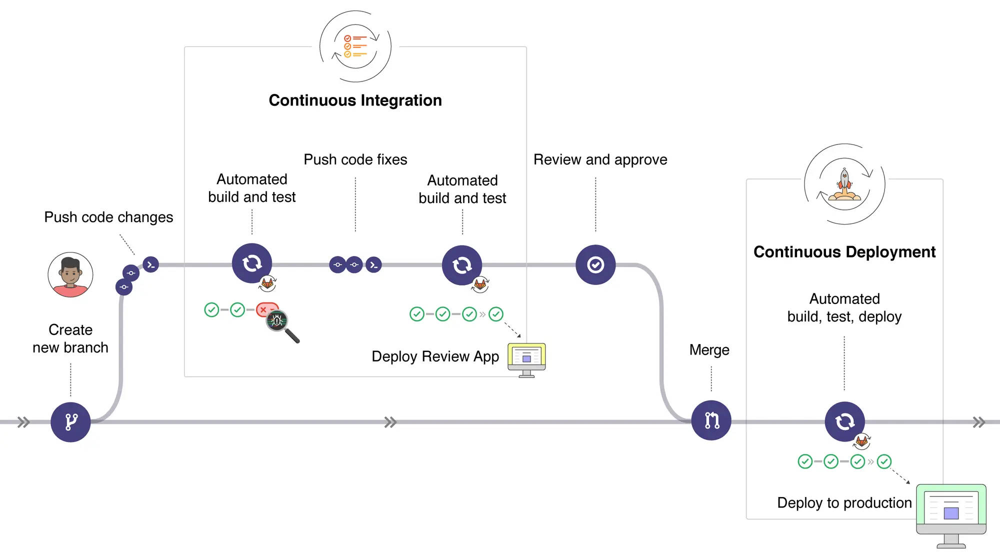
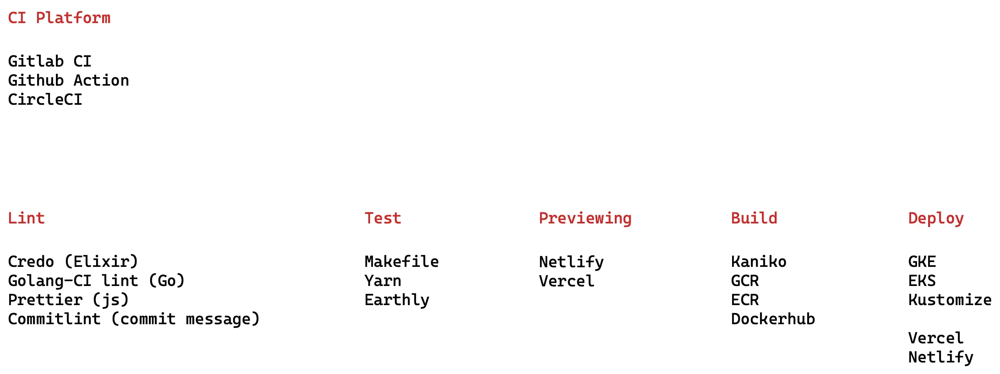
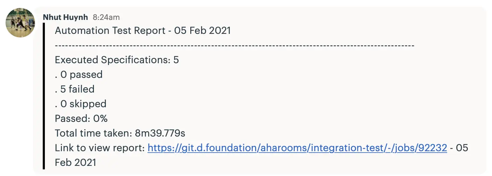

Before we dig through a detailed process, let's set some grounded knowledge about the CI/CD:

`CI` stands for continuous integration. It involves linting, testing, building, and merging developers' various code changes into a shared repository such as GitHub, Gitlab, or pushing software images to a container registry, usually multiple times per day.

On the other hand, `CD` refers to either continuous delivery or continuous deployment, which are sometimes used interchangeably. Either way, this typically refers to later stages of the software pipeline, and especially to how new code moves into production.

A simple way to understand the CI/CD is to take it as a process, often visualized as a pipeline, that involves some job like testing, building, ..., etc.

## The overall process @ Dwarves

At Dwarves, most projects happen in Gitlab, so Gitlab-CI would be our first adaption. Lately, more and more Ventures projects land in Github, we have to look at Github Action. It doesn't mention that we also have a CI/CD for a Frontend-ers setup with Netlify or Vercel.

But overall, the process should be really the same (or at least, the mental thoughts)

In our ideal setup, the full process should be:

### Linting
Make sure we have the same set of coding rules, formatter. The feedback will be provided automatically to the authors.

### Testing
Needless to say, this one make sure we don't mess up and set a ground where things can't go south.

### Previewing
This one is interesting. We don't want the reviewers to pull the branch and test locally because it takes forever, and we are a lazy piece of crap.

For frontend-ers, we set up a preview page to see and test the changes before merging it. Easily set up with Netlify or Vercel, the Pull Request will automatically bind with the URL.

It is a bit more complicated when it comes to the system level. We have to mimic the servers, database, and other stuff to preview it.

### Building
When things look right, we hit the merge button. This action will build a Docker image of a new codebase and put it in the container registry. We use Google Container Registry by default, Dockerhub for any experiments, and recently Amazon Elastic Container Registry.

### Deploying
When we have all the green lights, we pull the image from the Registry in our previous step into our Kubernetes cluster - a.k.a, where we run the servers.

## Test stack

## What to expect
### Simplify
We believe that setting up CI/CD is everyone's job. It should be a culture, not a DevOps thingy. Things should be simple, the process needs to be well-defined, we seek for tools that help us remove some of the obstacles.

A year ago, if we want to build an image inside a CI environment, we must know about Docker-in-Docker concept or mount the socket port. That's crazy, if you think about it because all we need to do is run a `docker build` and `docker push`. Then we found [kaniko](https://github.com/GoogleContainerTools/kaniko), a tool to build and push docker image without installing docker engine into our builder image.

Seeking for simplicity is a must in everything we do; setting up CI should be a 30-minute job instead of a long day waiting for Quang to come for the rescue.

### Automation E2E testing integrated
We want to do it for a long time. Imagine that all our code can adequately test, instant feedback will be provided to the author before any review. It guarantees that no matter what happens in the Pull Request, our application does not produce any regression bug or, worse, bring the whole application down.

It is a nice thing to do, but we’re still far from easily integrating that into our CI, since:
* The Automation Testing Framework sometimes does not reproducible.
* It takes too long to run a full set of tests; we don't want to get to the phase that we spend 1 hour for a typo change.
* We haven’t found a way to properly set it up in our workflow.

Experiments are and will be made to get us close to the goal. For now, we are settling with the daily scheduled E2E run, and the QC team will provide us with the results every day.

## CI - Continuous Improving
In the spirit of CI/CD, It's good to keep the final notes like this.

Technology is eating the world. The technology we used yesterday may be deprecated today. New technology has enabled us to create new things.

We build a team that wants to do innovative things, but innovation does not happen in a vacuum. It happens through many thoughts, experiments, assessments.

By the time we write this article, we are giving [Earthly](https://github.com/earthly/earthly) the shot to further upgrade our stacks. And we don't mean to stop exploring, pushing the boundaries so perhaps we will write a follow up article of this, maybe a year later
