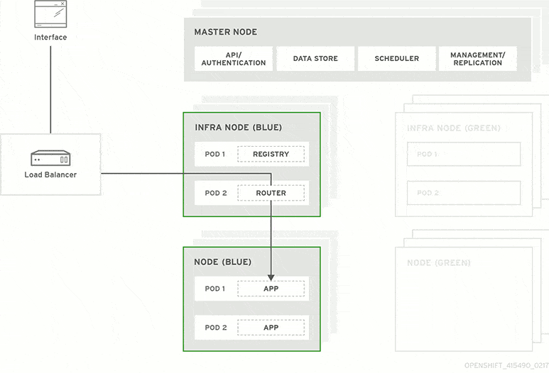

Blue-green deployment has become an important topic in modern software development, and this deployment strategy has become our focus on the [tech radar](https://radar.d.foundation/Blue-green-deployment-a93ea5c3d4d8439ba8701aec57d7ea3c). In a recent [radio talk](https://www.youtube.com/watch?v=R0FwoGw9raU), Quang Le, one of our DevOps engineers, presented the significance of blue-green deployment and its benefits. This memo is a quick recap of the talk.

## **A brief**
Blue-green deployment is a software deployment strategy that involves creating two identical environments: one that is live and serving user traffic (blue) and one that is not (green). The new version of the software is deployed to the green environment, and once the deployment is complete, traffic is switched from the blue to the green environment. This strategy allows for a seamless transition between versions, with reduced downtime, and the ability to roll back to the previous version if needed.

## Why it helps
There are several benefits to using blue-green deployment in modern software development:

* **Reduce downtime:** Blue-green deployment reduces downtime by deploying the new version of the software to a separate environment. This makes it possible to switch traffic from the old to the new version without any downtime.
* **Increase reliability:** By reducing the risk of downtime and service disruptions, blue-green deployment allows businesses to provide a more reliable and stable service to their customers. This can help improve customer satisfaction and loyalty, as well as reduce the risk of lost revenue due to service interruptions.
* **Improve flexibility:** Blue-green deployment allows for faster deployments, reduced risk, improved testing, and better resource utilization. This enables businesses to respond to changing market conditions more quickly and efficiently.
* **Minimize risk:** The old version of the software remains live and serving traffic until the new version has been fully deployed and tested. This reduces the risk of problems and errors affecting users.
* **Save costs:** Faster deployment and improved reliability can result in cost savings for a business. With less downtime and errors, businesses can avoid costly service disruptions. Teams can focus on feature delivery rather than dealing with customer complaints.

## **Q/A**
* **Q: Is it possible to control traffic to each service (x% to the active service and y% to the preview service)?**

**A:** That is possible, but it is no longer a blue-green deployment; it is a canary deployment.

* **Q: How do I make sure my app works correctly when applying migrations that change the database structure (delete tables or delete columns) or deprecate APIs?**

**A:** When applying migrations or deprecating API, your code must be backward compatible with the currently active version. For example, if you want to rename a certain column, you need to create a migration to create a new column, and change the query and response to the new column. Once the code is released and the new version is active, you can create a migration to delete that column.

* **Q: When do we need to apply blue-green deployment?**

**A:** It is not recommended to use blue-green deployment at the beginning of a project or when the project does not have many users because it will require a certain effort to set up. It should only be applied to applications with many continuous users or any systems that cannot tolerate disruption, for example, finance.
