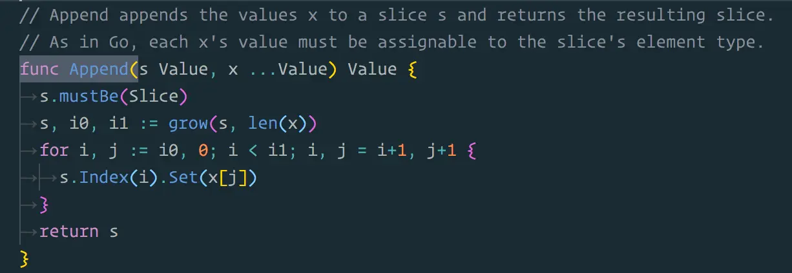
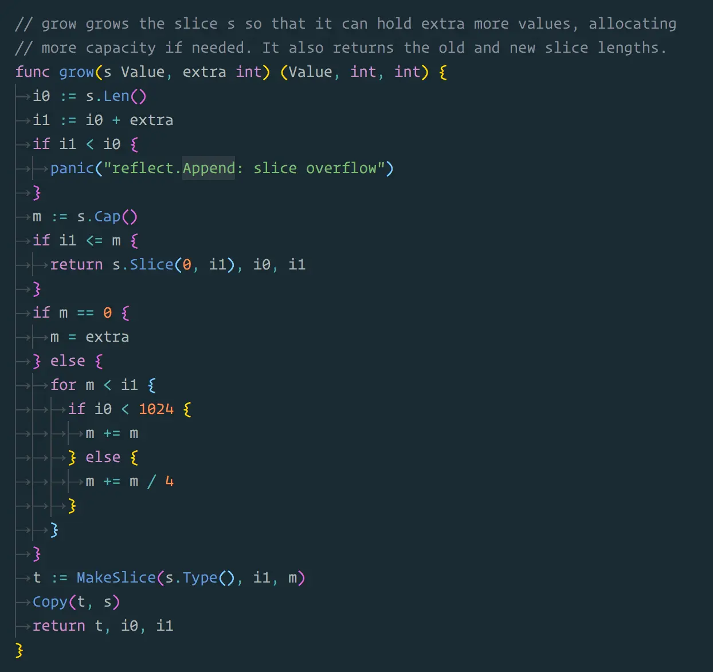

### Array
In Go language, the terminology `Array` has a bit different from another language like C, JS, ... In Go, the `array has a fixed length and type `Take a look of array implementation in Go.


Its length is part of its type ([4]int and [5]int are distinct, incompatible types). For example, you can compare two arrays have the same type [4]int.

```go
a := [4]int{1,1,1,1}
b := [4]int{0,0,0,0}
c := [4]int{}

fmt.Println(a == b) // false
fmt.Println(b == c) // true
fmt.Println(c == a) // false
```

As you can see, the array does not need to be initialized explicitly, the `array c` in the example above is initial with zero value of an array type (zero value of an integer is 0).

But two array [4]int and [5]int is incompatible with each other

```go
a := [4]int{}
b := [5]int{}

fmt.Println(a == b) // mismatched types [4]int and [5]int
```

You also can let Go's compiler count the array size for you at compile time.

```go
a := [...]int{1,1,1}
b := [3]int{1,1,1}

// in this example, both a and b have a [3]int type and can compare with
// each other

fmt.Println(a == b) // true
```

For representation for an array of [4]int in memory is for integer value laid out `sequentially`


So, in Go, the array is values. An array variable holds the entire array (not a pointer to the first element). Let's say the array is a struct ( but using index instead of named field). Because an array is not a pointer to the first element, so when we assign, pass an array to a function, it will make a copy of its content

**TL;DR:**

The different between array in Go and C:

* Arrays are values. Assigning one array to another copies all the elements.
* In particular, if you pass an array to a function, it will receive a copy of the array, not a pointer to it.
* The size of an array is part of its type. The types [4]int and [5]int are distinct.

### Slice
In Go code, we don't often see array because of its inflexible, slice - on the other hand - is everywhere. Slice is an abstraction built on top the array. Unlike the Array, Slice type has no specified length; you can declare a slice like an array but `without the count element`.

```go
a := []int{1,2,3,4}
```

A slice has three components (will be talking more detail in next section):

* `pointer` : point to underlying array
* `length ` : the number of elements referred to by the slice
* `capacity` : the number of elements in the underlying array

Because slices hold references to an underlying array, so if you assign one slice to another, both refer to the same array.

```go
a := []int{1,2,3,4}
b := a
b[0] = 10

fmt.Println(a) // [10 2 3 4]
```

We can make a slice by using built-in `make` function. When called, `make` allocates an array and returns a slice that refers to that array. Note that the zero value of a slice is `nil.`

```go
// make(type, length[, capacity])
a := make([]int,4,8)

// if we omit capacity, it defaults to the specified length
b := make([]int,4)

// len b = 4
// capacity b = 4
```

or `slicing` an array or another slice using these format

```go
a := []int{1,2,3,4,5,6,7,8,9,10}

b := a[0:5]
fmt.Println(b) // [1 2 3 4 5]

c := a[5:]
fmt.Println(c) // [6 7 8 9 10]

d := a[:5]
fmt.Println(d) // [1 2 3 4 5]

e := a[:]
fmt.Println(e) // [1 2 3 4 5 6 7 8 9 10]
```

The length and capacity of a slice can be inspected using the built-in `len` and `cap` functions.

```go
a := make([]int,4, 8)

fmt.Println(len(a)) // 4
fmt.Println(cap(a)) // 8
```

# 2. Slice internal
Let's take a look at `slice` implementation in Go.

```go
type slice struct{
	array unsafe.Pointer
	len int
	cap int
}
```

For example, if we create a slice by using make([]byte,5), the slice will be structured like this: 


A slice cannot be grown beyond its capacity. Attempting to do so will cause a runtime panic, just as when indexing outside the bounds of a slice or array. Similarly, slices cannot be re-sliced below zero to access earlier elements in the array.

**So the question is, What if we **`**append**`** an element to a slice which has reached its capacity?**

### Append
Let's dig into a source code (go/src/reflect/value)



so the `append` built in function do a few things here:

First, it will check an input value, if it's not a `Slice` the program will throw a panic, then the interesting things here is `grow` function , it will take an old slice and length of the new slice we want to append. Let take a look at `grow` function:



So now we understand the mechanism behind the `append` function, it will allocate a `new Slice` which have more capacity than the old one

The interesting thing is how Go decide how much capacity the new slice is. As you can see if the old slice capacity is lesser than 1024, it will double the old slice's capacity, but when it grows bigger than 1024 Go adds `old slice's capacity / 4` to the old capacity

### Appendix
* [https://golang.org/doc/effective_go.html#slices](https://golang.org/doc/effective_go.html#slices)
* [https://blog.golang.org/slices](https://blog.golang.org/slices)