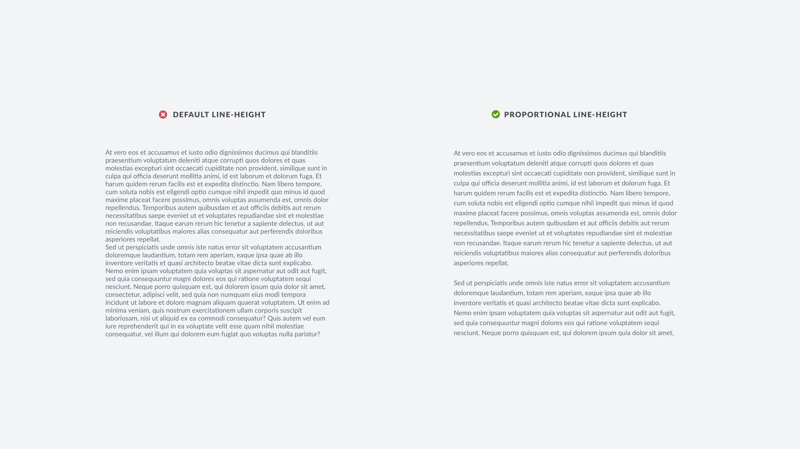
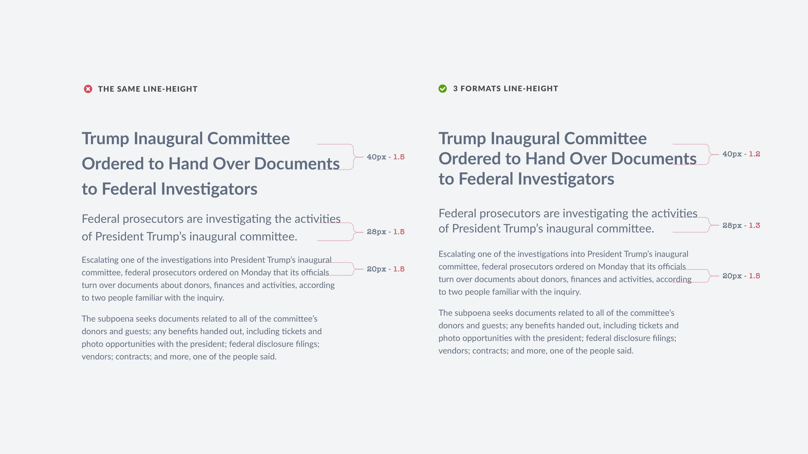

## Vertical spacing
### Spacing within each paragraph
Firstly, I start the simplest content type — paragraph. One of the atoms decides aesthetic design. So you need to focus on them. You commonly depend on default line-height of the font to design the content. I have increased line by 2px to 3px in this way because they are too tight.

Everything almost has a proportional so line-height also it. **1.5** is a suggestion for you to have a good starting point.

However, you should not use the same line-height for all text. Here is a common mistake for beginners. 1.5 is a great proportional for body text, but as heading or title, it should get tighter. I suggest that the text of the content will use the title of **1.2**, the subtitle of **1.3** and the body copy of **1.5**.

### Spacing between two consecutive paragraphs
I found a rule is to use paragraph spacing equal to font-size of the content using. By that, we can remember spacing easier. Besides, note you should use paragraph spacing instead of hitting enter to go down a line. As of spacing when you hit enter this is too larger, the paragraph will control white space easier between two consecutive paragraphs.

### Spacing within the list items in a list
When you design a list item with a multi data structure, you should not divide into the margins of the list the same. It won’t feel obvious or connected. The user has to work hard to interpret data and can misunderstand the meaning as of putting the wrong item. This solution is to split the space each a group into two formats size.

### Spacing within input fields with labels
You can see difference spacing between the two consecutive input fields in labels.

In the left, if you equalize spacing for all input fields, it seems tight and not look actively bad. The label doesn’t have a visual hierarchy. Moreover, the user can’t quickly scan them. The problem with the first card is the spacing of that labels don’t have breathing room necessary and divide the system-level sizing.

In the right, it seems perfect more and improves the legibility of the user. My approach is to start designing something with too much spacing, then remove it until you have an eye-catching design. You need to notice that you should have some difference between the spacing and divide the least three formats in your design (small, medium and large spacing) ( I mentioned it in [part 1)](https://medium.com/dwarves-design/the-principle-of-spacing-in-ui-design-part-1-3354d0d65e51). In addition, they can support you to define the system. **16px** is a great number to start because it divides nicely ( 4px = **16** x 0.25, 8px = **16** x 0.5, 12px = **16** x 0.75, …)

You usually start to add a bit of white space. If something is too cramped, you will add a bit more spacing until everything looks better in your design. By this way, you only have a minimum spacing. So you need more space. This way will take a lot of your time and not have a good result. One of the ways to have an elegant design is your design should start with too much white space.

## Horizontal spacing
### Spacing inside components
I suggested the bottom values of input and button to design better. You can see clearly with font-size 16px on phone screen or computer monitor. 16px of horizontal padding for both is a number that easy to remember when it defined in term of font-size.

### Spacing two components
When you design a form with labels, if spacing in labels is the same, the elements in the form group won’t explicitly associate. The user feels ambiguous about content. If there isn’t a visible separator, there isn’t obvious.

### Spacing between icons
It’s not only vertical spacing but also horizontal spacing it’s easy to make this mistake with components that are laid out horizontally, too:

Whatever you want to connect a group of elements, you always make sure around the padding of the group is more than within it.

### Spacing within components with icons
I used 8px for spacing between components with icons. It is a great number that you can apply for any adjacent components and connect them together. You can choose another reasonable number — giving yourself the freedom to find a lot of easier to build a better UI design.

## In conclusion
* You will improve the readability/legibility of the user by respect information hierarchy, allow track and comprehend information more easily.
* You will have a strong spacing system with limited values and limited application rules
* Developers will become faster as they know all the rules of your spacing system.

You can follow me on [https://dribbble.com/Anna23593](https://dribbble.com/Anna23593) and thank you for taking the time to read it.
